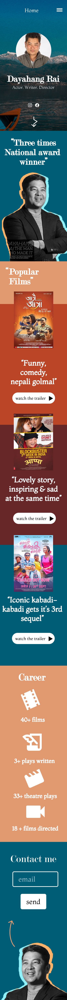

Dayahang Rai website redesign project `development | git repo`

How to run project on your computer?

Steps:

1. Clone the repo
2. Open it with vscode or any preferred editor.
3. Open terminal and run following command.

    2. `npm install` 
        - If error just run `npm cache clean --force`
    
    5. `npm run start-dev` to run webpack dev server to quickly get started. 
        - No need to add style.css webpack will automatically take care of it. Go to [localhost:8080/](localhost:8080) to view your website. By default hot reloading is on. 
    3. `npm run build` to build your dist directory.

Checkout `webpack.config.js` & `postcss.config.js` for further customisation of configuration.
    
<!-- 

Design 
💻 `desktop mode`

📱 `mobile mode`

 -->

 

Hey it's me [abisekh](https://github.com/abisekhsubedi) who redesigned it. If you like my work, please ⭐ the repo. And I'm open for work. What I do? I do UI design and web development. Just send me mail <a href="mailto:abisekhsubedi8765@gmail.com">here</a> so we can get started quickly making your amazing website.

 

🎨 [@abisekhsubedi](https://abisekhsubedi.github.io)

<!-- 
font-family: 
base: montaga 18px
heading : modern no 20
link: roboto

 -->